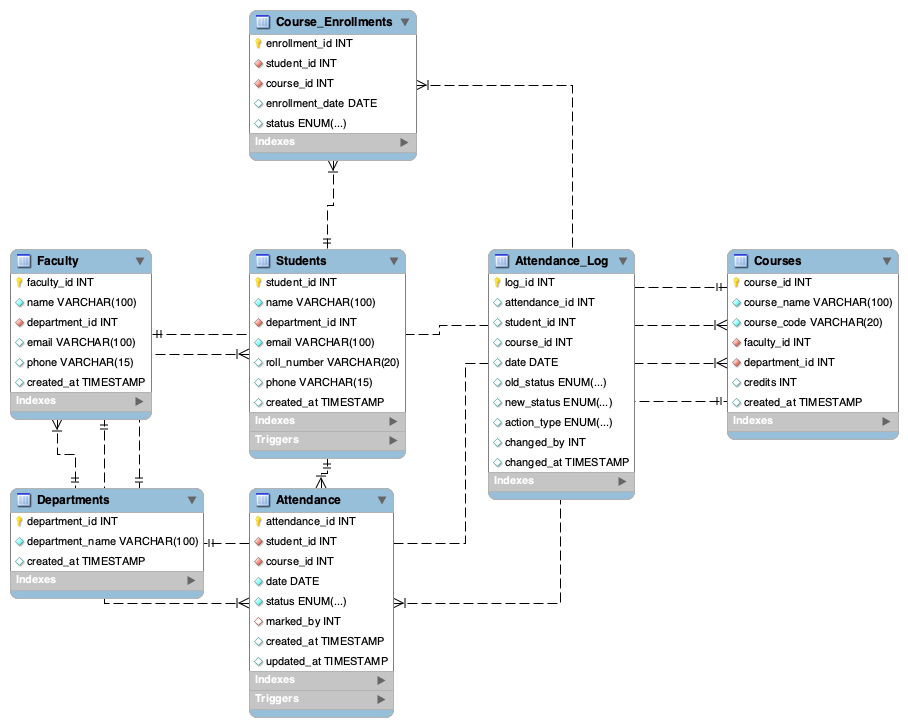

<h4>Name: Anjali</h4>
<h4>USN: 1JS23IS014</h4>
<h4>Course: DBMS Lab (BCS403) Mini Project</h4>
<h4>Student Attendance Management System</h4>

### About

A comprehensive database management system for tracking student attendance across multiple courses, departments, and faculty members.

This system provides a complete solution for educational institutions to manage student attendance efficiently. It includes proper database design with normalization up to 3NF, comprehensive CRUD operations, triggers for audit logging, and stored procedures for complex operations.

### ER Diagram

### Table Creation

### Procedures Creation

### Triggers Creation

### Sample Data

### Query Examples

###### Attendance Summary with Aggregation

###### Call attendance percentage calculation procedure

###### Department-wise attendance statistics

