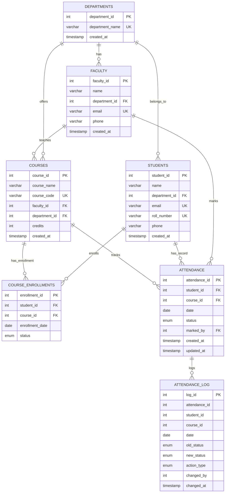
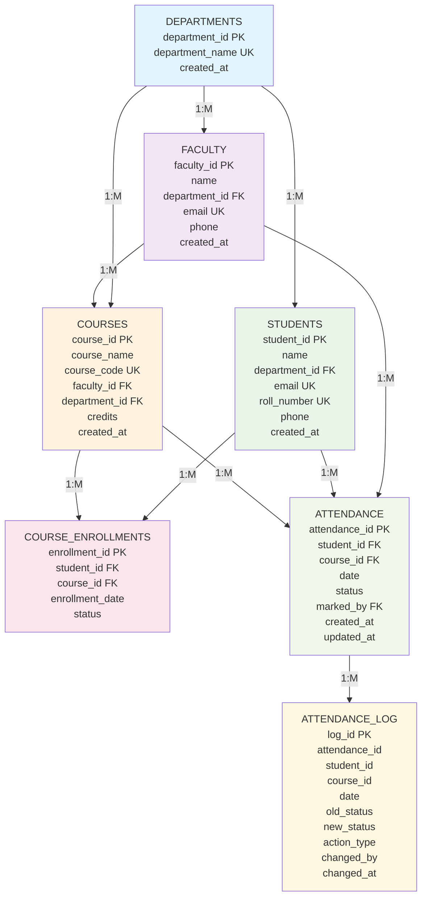
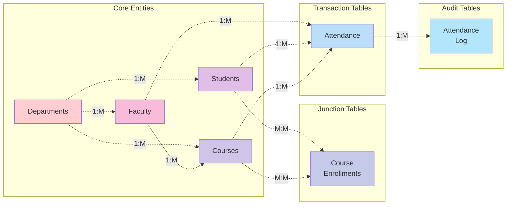
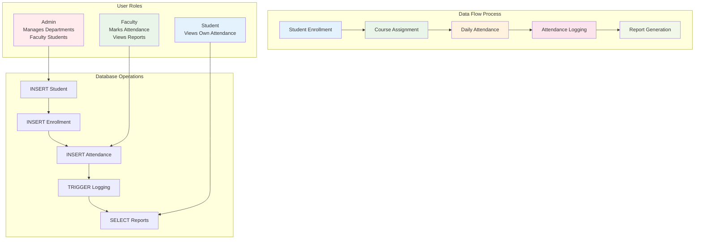

# ER Diagram

## Entity Relationship Diagram

### Complete ER Diagram (Mermaid)



### Detailed Entity Relationship Flow



### System Architecture Overview



### Entities and Attributes

#### 1. **Departments**

- **department_id** (PK) - Primary Key
- department_name - Unique department name
- created_at - Timestamp

#### 2. **Faculty**

- **faculty_id** (PK) - Primary Key
- name - Faculty member name
- department_id (FK) - Foreign Key to Departments
- email - Unique email address
- phone - Contact number
- created_at - Timestamp

#### 3. **Students**

- **student_id** (PK) - Primary Key
- name - Student name
- department_id (FK) - Foreign Key to Departments
- email - Unique email address
- roll_number - Unique roll number
- phone - Contact number
- created_at - Timestamp

#### 4. **Courses**

- **course_id** (PK) - Primary Key
- course_name - Course name
- course_code - Unique course code
- faculty_id (FK) - Foreign Key to Faculty
- department_id (FK) - Foreign Key to Departments
- credits - Number of credits
- created_at - Timestamp

#### 5. **Course_Enrollments** (Junction Table)

- **enrollment_id** (PK) - Primary Key
- student_id (FK) - Foreign Key to Students
- course_id (FK) - Foreign Key to Courses
- enrollment_date - Date of enrollment
- status - Enrollment status (Active, Dropped, Completed)

#### 6. **Attendance**

- **attendance_id** (PK) - Primary Key
- student_id (FK) - Foreign Key to Students
- course_id (FK) - Foreign Key to Courses
- date - Attendance date
- status - Attendance status (Present, Absent, Late)
- marked_by (FK) - Foreign Key to Faculty
- created_at - Timestamp
- updated_at - Last update timestamp

#### 7. **Attendance_Log** (Audit Table)

- **log_id** (PK) - Primary Key
- attendance_id - Reference to Attendance
- student_id - Student reference
- course_id - Course reference
- date - Attendance date
- old_status - Previous status
- new_status - New status
- action_type - Type of action (INSERT, UPDATE, DELETE)
- changed_by - Who made the change
- changed_at - When the change occurred

## Relationships

### 1. **Department → Faculty** (One-to-Many)

- One department can have multiple faculty members
- Each faculty belongs to exactly one department
- **Relationship**: `Departments.department_id ← Faculty.department_id`

### 2. **Department → Students** (One-to-Many)

- One department can have multiple students
- Each student belongs to exactly one department
- **Relationship**: `Departments.department_id ← Students.department_id`

### 3. **Department → Courses** (One-to-Many)

- One department can offer multiple courses
- Each course belongs to exactly one department
- **Relationship**: `Departments.department_id ← Courses.department_id`

### 4. **Faculty → Courses** (One-to-Many)

- One faculty member can teach multiple courses
- Each course is taught by exactly one faculty member
- **Relationship**: `Faculty.faculty_id ← Courses.faculty_id`

### 5. **Students ↔ Courses** (Many-to-Many via Course_Enrollments)

- One student can enroll in multiple courses
- One course can have multiple students enrolled
- **Junction Table**: `Course_Enrollments`
- **Relationships**:
  - `Students.student_id ← Course_Enrollments.student_id`
  - `Courses.course_id ← Course_Enrollments.course_id`

### 6. **Students → Attendance** (One-to-Many)

- One student can have multiple attendance records
- Each attendance record belongs to exactly one student
- **Relationship**: `Students.student_id ← Attendance.student_id`

### 7. **Courses → Attendance** (One-to-Many)

- One course can have multiple attendance records
- Each attendance record belongs to exactly one course
- **Relationship**: `Courses.course_id ← Attendance.course_id`

### 8. **Faculty → Attendance** (One-to-Many)

- One faculty member can mark attendance for multiple records
- Each attendance record can be marked by one faculty member
- **Relationship**: `Faculty.faculty_id ← Attendance.marked_by`

### Data Flow and Process Diagram



## Constraints

### Primary Key Constraints

- Each table has a unique primary key
- Auto-incrementing integer IDs for all entities

### Foreign Key Constraints

- All foreign keys reference valid primary keys
- CASCADE DELETE for maintaining referential integrity
- RESTRICT UPDATE to prevent orphaned records

### Unique Constraints

- `Students.email` - Unique email addresses
- `Students.roll_number` - Unique roll numbers
- `Faculty.email` - Unique faculty emails
- `Courses.course_code` - Unique course codes
- `Departments.department_name` - Unique department names

### Check Constraints

- `Courses.credits > 0` - Credits must be positive
- `Attendance.status` - Must be one of: Present, Absent, Late
- `Course_Enrollments.status` - Must be one of: Active, Dropped, Completed

### Not Null Constraints

- All primary keys
- Essential attributes like names, emails, dates

## Textual ER Diagram Representation

```
[Departments] 1----M [Faculty] 1----M [Courses]
     |                                   |
     |                                   |
     1                                   1
     |                                   |
     M                                   M
[Students] M----M [Course_Enrollments] M----1
     |
     |
     1
     |
     M
[Attendance] M----1 [Faculty]
     |
     |
     1
     |
     M
[Attendance_Log]
```

## Business Rules

1. **Department Rules**:

   - Each department must have a unique name
   - Departments can exist without faculty or students

2. **Faculty Rules**:

   - Faculty must belong to a department
   - Faculty can teach multiple courses
   - Faculty email must be unique

3. **Student Rules**:

   - Students must belong to a department
   - Student email and roll number must be unique
   - Students can enroll in multiple courses

4. **Course Rules**:

   - Courses must be assigned to a faculty and department
   - Course codes must be unique
   - Credits must be positive

5. **Enrollment Rules**:

   - Students can enroll in multiple courses
   - Enrollment status tracks student progress

6. **Attendance Rules**:

   - Attendance is tracked per student per course per date
   - Only one attendance record per student per course per date
   - Attendance can be marked by faculty
   - Status must be Present, Absent, or Late

7. **Audit Rules**:
   - All attendance changes are logged
   - Logs maintain history of modifications
   - Deletion logs are maintained for compliance
